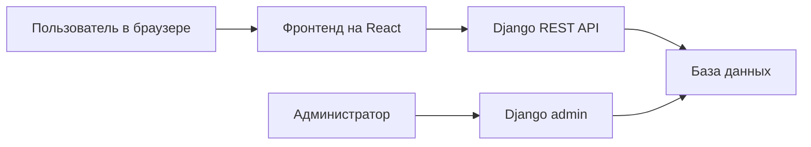

# Архитектура

## Общая схема

Проект состоит из двух основных частей:

- Бэкенд на Django
- Фронтенд на React

Бэк отдает REST API, фронт обращается к нему через HTTP запросы.  
Данные хранятся в базе. Для управления товарами и заказами также используется стандартная Django admin.




## Бэкенд
Cтруктура:

```
backend/
  manage.py
  config/
    settings.py
    urls.py
  apps/
    users/
    catalog/
    cart/
    orders/
    reviews/
```

Приложения разделены по смыслу:

- `users` -- пользователи и авторизация
- `catalog` -- товары и категории
- `cart` -- корзина
- `orders` -- заказы
- `reviews` -- отзывы

## Фронтенд
Структура:

```
frontend/
  src/
    api/
    app/
    components/
    features/
      auth/
      catalog/
      cart/
      orders/
    pages/
    shared/
```

Основные страницы:

- главная
- каталог
- карточка товара
- корзина
- оформление заказа
- вход и регистрация
- история заказов

## REST API

API строится вокруг основных ресурсов:
```
/categories/
/products/
/cart/
/orders/
/reviews/
/auth/
```
Примерные запросы:
```
GET    /api/products/
GET    /api/products/{id}/
GET    /api/categories/

GET    /api/cart/
POST   /api/cart/items/
PATCH  /api/cart/items/{id}/
DELETE /api/cart/items/{id}/

GET    /api/orders/
POST   /api/orders/
GET    /api/orders/{id}/

GET    /api/products/{id}/reviews/
POST   /api/products/{id}/reviews/
```
где

- `GET` - получить данные
- `POST` - создать объект
- `PATCH` - частично обновить объект
- `DELETE` - удалить объект

## Основные модели

Планируемые модели:
```
Category
Product
Cart
CartItem
Order
OrderItem
Review
```
У товара будут категория, название, описание, цена, остаток в шопе и тип товара.

Типы товаров:
```
drink
bakery
beans
equipment
machine_part
```
У заказа будут статусы:
```
created
paid
in_progress
ready
completed
cancelled
```
## Корзина и оформление заказа

Пользователь добавляет товары в корзину.  
После этого он может оформить заказ.

При создании заказа нужно:

1. проверить, что корзина не пустая
2. проверить, что товары есть в наличии
3. создать заказ
4. создать позиции заказа
5. уменьшить остатки товаров
6. очистить корзину

Это будет реализовано отдельным файлом:
`orders/services.py`

Например:

`create_order_from_cart(user)`

## Права доступа

Гость может смотреть каталог и карточки товаров.

Авторизованный пользователь может:

- добавлять товары в корзину
- оформлять заказ
- смотреть свои заказы
- оставлять отзывы

Администратор может управлять товарами, категориями и заказами через Django admin.

## Технический стек из Django

В проекте используются:

- модели Django
- миграции
- Django admin
- serializers
- viewsets / API views
- permissions
- авторизация по токену
- тесты

## Тесты

План тестов:

- список товаров доступен без авторизации
- пользователь может добавить товар в корзину
- нельзя заказать товара больше, чем есть на складе
- заказ создается из корзины
- после создания заказа уменьшается остаток товара
- пользователь не может смотреть чужие заказы
- пользователь не может менять чужие отзывы
