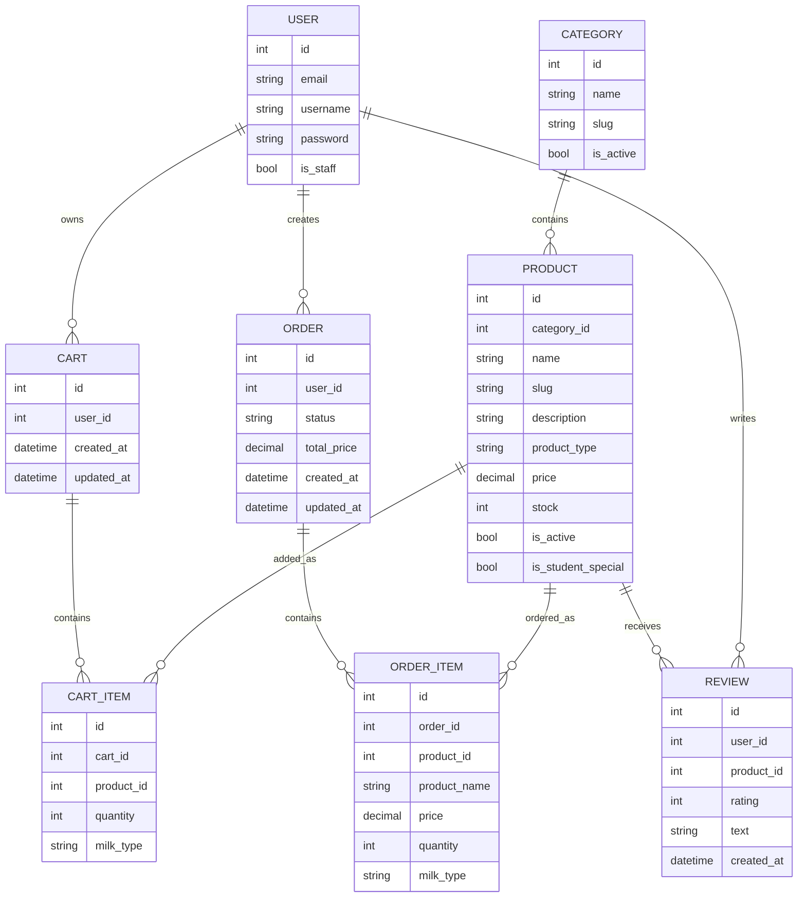

# Проектирование базы данных

## Основные сущности

- User
- Category
- Product
- Cart
- CartItem
- Order
- OrderItem
- Review

## ER-диаграмма

## Типы продуктов

Планируемые типы товаров:

- `drink` - напиток
- `bakery` - выпечка
- `beans` - зерна
- `equipment` - аксессуар
- `machine_part` - деталь для кофемашины

## Статусы

Планируемые статусы заказа:

- `created` - заказ создан
- `paid` - заказ оплачен условно или подтвержден
- `in_progress` - заказ готовится
- `ready` - заказ готов к выдаче
- `completed` - заказ завершен
- `cancelled` - заказ отменен
